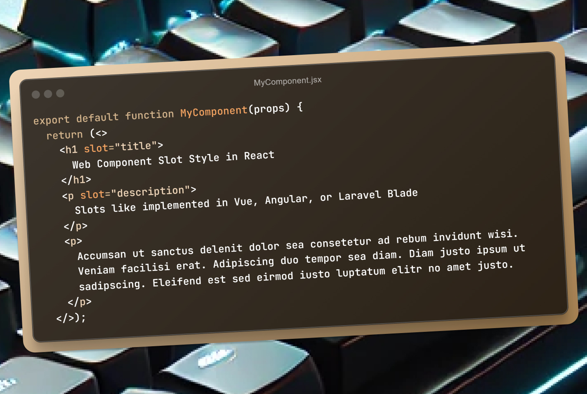

# The Thing

Recently I read some articles about how do you implement slots in React and there are numerous options that we can use to solve this particular problem. I read an article [Building Component Slots in React](https://sandroroth.com/blog/react-slots) written by [Sandro Roth](https://sandroroth.com/) that shows some approach to do this, and we have the popular one called compound components pattern, which we put compound components as “children properties” of it’s core component that then we can compose the component where do we want to call them. But this approach will make the main component become cumbersome if we have plenty of slots inside of it. Especially if we have conditional components, it would make the main component become full of conditional checking.



Slotted Component in React

Slots are popular used in [Angular](https://angular.io/guide/content-projection), [Vue.js](https://vuejs.org/guide/components/slots.html), even in [Laravel Blade](https://laravel.com/docs/10.x/blade#slots). I used to use this kind of approach to develop UI for applications because it’s flexible, simple, and make layouts reusable in readable way.

Another approach that i found closest to my intention to implement slots in React with Web Component style is [this package](https://www.npmjs.com/package/use-componentslots) from [Mike Ritchie](https://github.com/starkraving) that we can literally use `<Slot name="header" />` tag like this inside the main component then can be called with the parent component with `slot` props inside the element/component. Unfortunately, this package is not quite supported by Typescript React and has buggy implementation especially when the parent component rerenders the slotted component.

Then I’ve come up by forking the package and modify it so it would be compatible with Typescript and also compatible when the component rerenders by using this custom simple React hooks that you can also implement it by yourself:

```tsx
import React, { useMemo } from "react";
const useSlots = (componentChildren) => {
  const slots = useMemo(() => {
    return React.Children.toArray(componentChildren).reduce(
      (collector, child) => {
        let slotName = "general";
        if (React.isValidElement(child)) {
          slotName = child.props.slot || "general";
        }
        if (!collector[slotName]) {
          collector[slotName] = [];
        }
        collector[slotName].push(child);
        return collector;
      },
      { general: [] }
    );
  }, [componentChildren]);
  const slot = (name = "", defaultChildren = []) => {
    let _a;
    const children = !name
      ? slots.general
      : (_a = slots[name]) !== null && _a !== void 0
      ? _a
      : defaultChildren;
    return React.createElement(React.Fragment, {}, children);
  };
  const hasSlotFunction = (slot) => {
    return slots.hasOwnProperty(slot) && slots[slot].length > 0;
  };
  return [slot, hasSlotFunction];
};
export default useSlots;
```

With that custom hook prepared, you then can define your own component with slots like this:

```tsx
export default function MyComponent({children}) => {
  const [slot] = useSlot(children);

  return (
    <div>
      <header>
        {slot('header', <>Default component</>)}
      </header>
      <main>
        {slot()}
      </main>
    </div>
  )
};
```

If you want to utilize conditional checking that if the parent component has certain “slot” property that will be rendered conditionally, you can also implement it like this:

```tsx
export default function MyComponent({children}) => {
  const [slot, isSlotExist] = useSlot(children);

  return (
    <div>
      <header>
        {slot('header', <>Default component</>)}
      </header>
      <main>
        {slot()}
      </main>
      {isSlotExist('footer') &&
      <footer>
        {slot('footer')}
      </footer>
      }
    </div>
  )
};
```

After that, within your parent component, you can effortlessly place the slotted component by simply writing this code, enabling webcomponent slots approach seamlessly for your application.

```tsx
<MyComponent>
  <h1 slot="title">My Component Title</h1>
  <p slot="description">Some descriptive text</p>
  <p>General content inside the module</p>
</MyComponent>
```

But if you want simpler ready to use this custom React hooks, I already made it as a package forked from its original repository and you can also check that out here, [React Use Slots.](https://www.npmjs.com/package/react-use-slots)