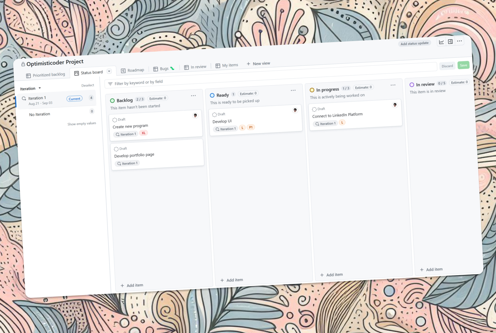

# Introduction

Today, Agile methodology is being used across companies, teams, or even for developing personal projects. Agile and scrum are know terms that commonly used in software development. The Agile itself is a set of values and principles for software development that emphasize flexibility, collaboration, and customer satisfaction as the [Agile Manifesto](https://agilemanifesto.org/) says, but we will cover it later.

Github Projects

[Scrum in the other hand, is a framework](https://scrumguides.org/scrum-guide.html#scrum-definition) that can be used for developing projects with Agile methodology. The Scrum framework consists of set of roles, artifacts, and ceremonies that guide the team in development process and one of the Scrum ceremony is Sprint Planning which our main topic here especially with use of Github Projects.

# GitHub Projects

GitHub Projects is a tool for managing and tracking work items in Software Development (even though you can use GitHub Project for other uses too). It provides a visual representation of the progress of the project. With GitHub Projects, people of its organization can create project tracker with these formats:

- Kanban Board
- Table
- Gantt Chart

The plus point of using GitHub Projects for Scrum and software development is, it is connected directly to our GitHub repositories and issues, so every issues, cards, or object that created in this project tracker is synced with the issues in our repositories.

## How To Do Sprint Planning With GitHub Projects

Effective sprint planning meetings are a critical part of Agile development. They enable teams to establish goals, define tasks, and set expectations for the upcoming sprint. However planning and tracking the progress of multiple departments involved in a project can be challenge. That’s where GitHub Projects comes in handy.

There steps or outline that you can use to do a sprint planning meeting with GitHub Projects. I’m trying to make an example for sprint planning that involves 3 departments of Developers, UI UX, and Product Development. Do not forget to invite your teams to the meeting first!

## Review Last Meeting

- Review previous sprint’s progress and identify any unfinished work then move the unfinished work to upcoming sprint as new sprint backlog
- Review the current state of the project board in GitHub Projects, it involves examining the cards on the board, their status, and the columns they are in. It’s a way to gain a quick overview of the project’s status to identify any potential issues.
- Mark every pending issues and address this issue **first** when we start the meeting

## Review and Update the Project Tracker

- Discuss the upcoming sprint goals and priorities and match the upcoming sprint goals with the backlog board
- Define the scope of the work for upcoming sprint
- Create new cards for upcoming sprint then assign task to team members and **set deadlines!**
- Identify any potential blockers or issues and fill them in card details

## Create Break Down the Work and Assign Tasks

- Discuss the work items (from backlog) for the upcoming sprint and break them down into smaller tasks (move to sprint backlog and fill the details)
- Assign tasks to individual team members based on their capability
- Ensure that each task has clear definition of **done** and **acceptance** criteria

## Discuss Any Requirements

- Review the design requirements for the upcoming sprint, do not forget to mention user flow for the upcoming development additions and discuss any design constraints or considerations
- Assign tasks to the UI/UX team to create or update design elements
- Discuss with developers to make sure the requirements is doable and realistic to be developed

## Review the Sprint Schedule and Set Expectations

- Review the sprint schedule and confirm that it is realistic
- Set expectations for communication and collaboration during the sprint
- Confirm that everyone understands their roles and responsibilities for the upcoming sprint
- Every card that created will become and issue in the repo so the developers can track directly and make pull requests to solve every issues addressed

## End the Meeting with Action Items and Next Steps

- Summarize the action items and next steps for the upcoming sprint
- Confirm that everyone is clear on their tasks and deadlines
- Encourage everyone to communicate openly and regularly during the sprint

With this, it should be able to help you develop using GitHub Projects because it is really powerful tool for managing and tracking work items in a software development project. By combining Scrum and GitHub Projects, it should be easy to develop in the future time.